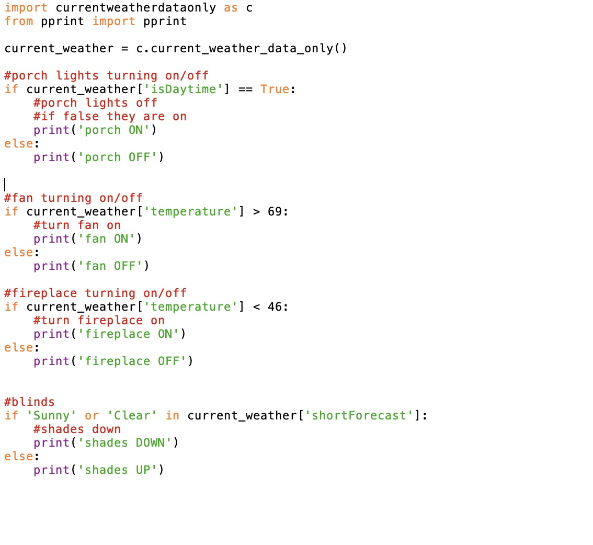

# dig333-final-project
Final Project Log

Project Proposal: [Proposal Slides - Including Schematics](https://docs.google.com/presentation/d/1VCNRhh4Yt2g6CyYGfm-fvS7Go773UuG2uuAi2unPjNQ/edit?usp=sharing)

## Milestone 1: Getting Weather Data From Internet to Raspberry Pi

National Weather Service API: https://api.weather.gov/

Davidson Weather: https://api.weather.gov/points/35.499302,-80.848686

GET Davidson Weather request: https://api.weather.gov/gridpoints/GSP/116,76/forecast/hourly

Installed [JSON](https://chrome.google.com/webstore/detail/json-viewer/gbmdgpbipfallnflgajpaliibnhdgobh?hl=en-US) Chrome browser extension and [Postman](https://web.postman.co/onboarding/user) onto computer to read data.

[Python Code that turns weather data into readable file](https://github.com/malloryjustis/dig333-final-project/blob/main/weatherdatafromapi.py)

[Python Code that narrows down weather data to current weather](https://github.com/malloryjustis/dig333-final-project/blob/main/currentweatherdataonly.py)

## Milestone 2: Create Python Code that Will Connect Weather Data to GPIO for Output

The following screenshot shows the general code outline for turning the weather data dictionary into GPIO output:

[GPIO Code](https://github.com/malloryjustis/dig333-final-project/blob/main/python_codes/weather_to_gpio.py)
