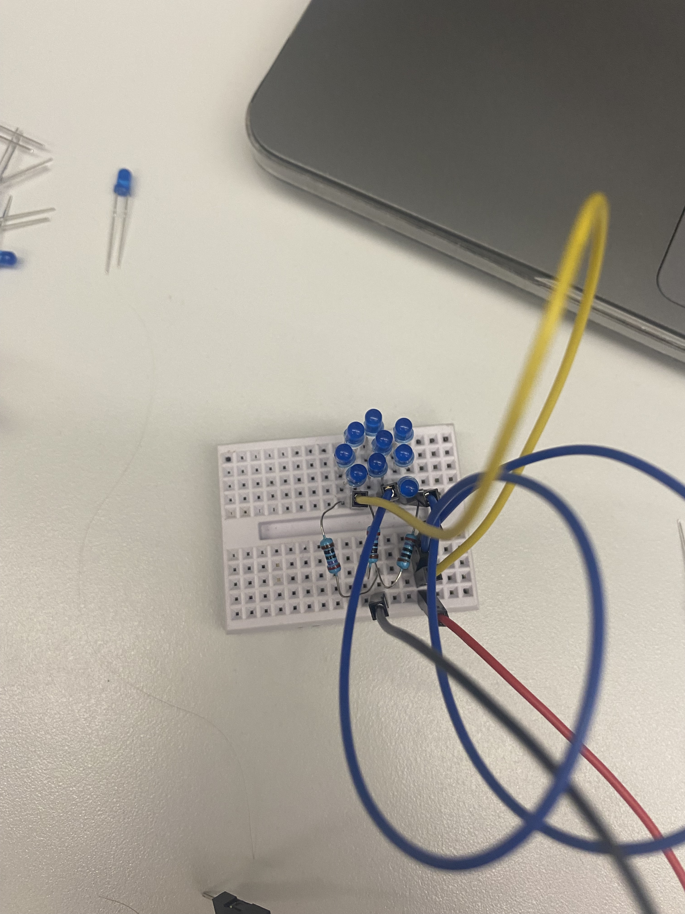
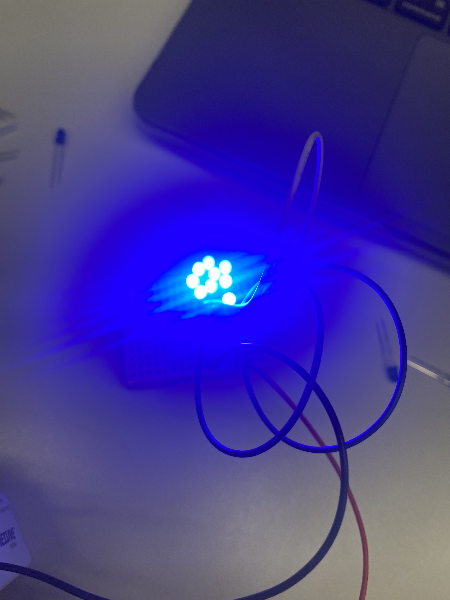
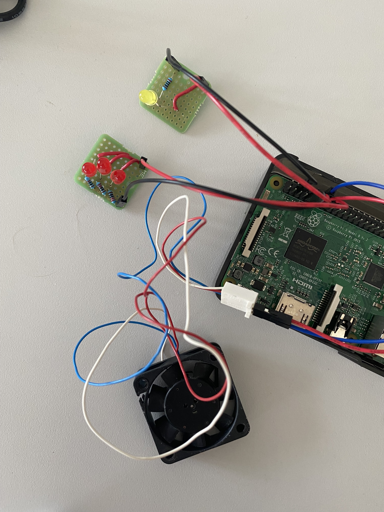
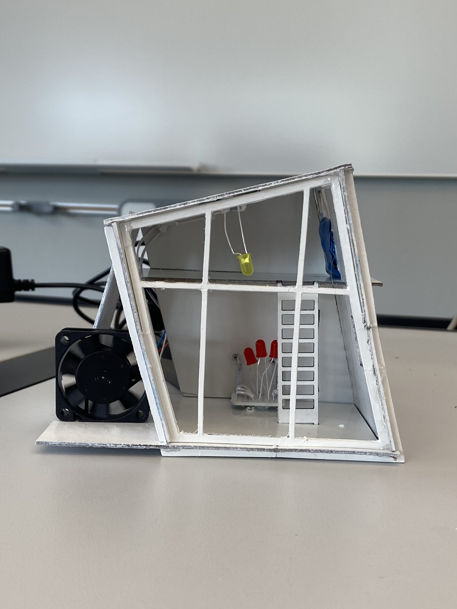
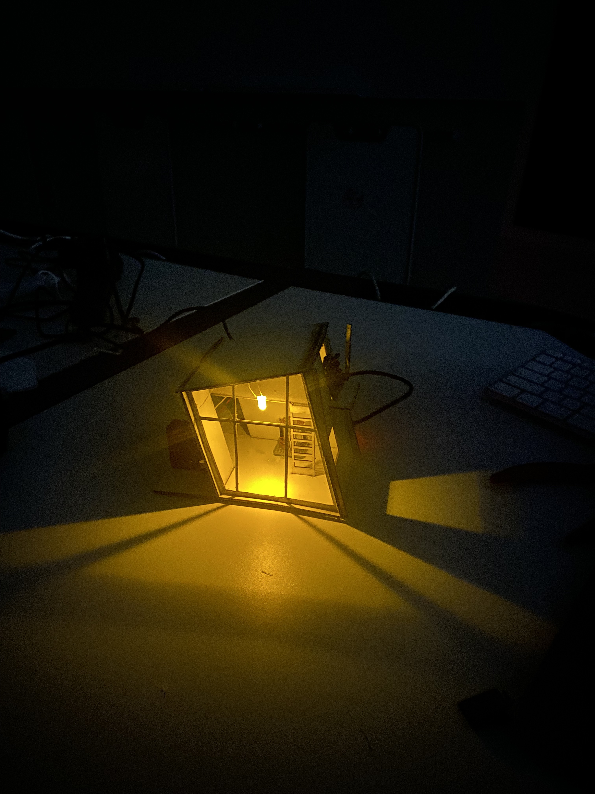
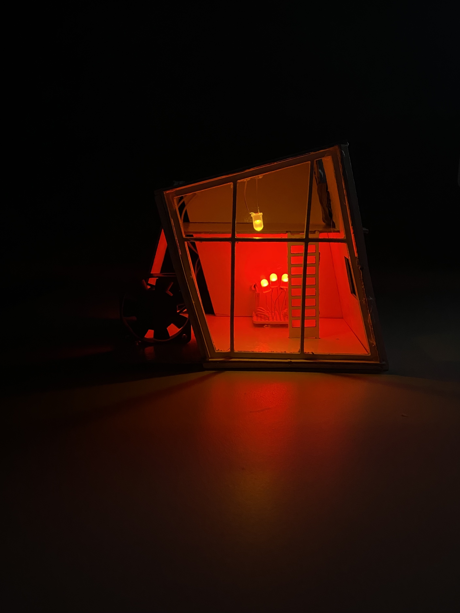

# dig333-final-project
Final Project Log

Project Proposal: [Proposal Slides - Including Schematics](https://docs.google.com/presentation/d/1VCNRhh4Yt2g6CyYGfm-fvS7Go773UuG2uuAi2unPjNQ/edit?usp=sharing)

## Milestone 1: Getting Weather Data From Internet to Raspberry Pi

National Weather Service API: https://api.weather.gov/

Davidson Weather: https://api.weather.gov/points/35.499302,-80.848686

GET Davidson Weather request: https://api.weather.gov/gridpoints/GSP/116,76/forecast/hourly

Installed [JSON](https://chrome.google.com/webstore/detail/json-viewer/gbmdgpbipfallnflgajpaliibnhdgobh?hl=en-US) Chrome browser extension and [Postman](https://web.postman.co/onboarding/user) onto computer to read data.

[Python Code that turns weather data into readable file](https://github.com/malloryjustis/dig333-final-project/blob/main/weatherdatafromapi.py)

[Python Code that narrows down weather data to current weather](https://github.com/malloryjustis/dig333-final-project/blob/main/currentweatherdataonly.py)

## Milestone 2: Create Python Code that Will Connect Weather Data to GPIO for Output

The following screenshot shows the general code outline for turning the weather data dictionary into GPIO output:

Here is the [GPIO Code](https://github.com/malloryjustis/dig333-final-project/blob/main/python_codes/weather_to_gpio.py) that turns the data in the Python code into an output for the hardware.

## Milestone 3: Create Hardware System that Works with Python Code

Hardware setup:

Running code manually to figure out bugs:

Porch light turning on at midnight when the code is run:

Using [Crontab](https://crontab.guru/#@hourly) to make code run hourly:

## Fixes

The Weather API that I was using was unreliable; servers kept going down. So I decided to use a different [API](https://api.weatherusa.net/v1/forecast?q=35.227085,-80.843124&daily=0&units=e&maxtime=7d). The codes are still the same, just with a different link and different dictionary keys. All new python files have the same names at the previous ones, just with a 2 at the end. The codes are in the [Python Codes](https://github.com/malloryjustis/dig333-final-project/tree/main/python_codes) folder.

I realized that if I was going to create blinds with a servo motor, if the blinds shut, it would cover the fireplace and the inside light, so I decided to add a solar panel instead. The panel lights up if it is sunny or partly cloudy during the day. This also works better with the aethetics of the house; it is more futuristic. It adds another color as well.

I created a solar panel with an array of mini blue LEDs:

## Milestone 4: Designing the House

Found Adobe Illustrator vector file for download from an [Etsy shop](https://www.etsy.com/listing/786887665/16-miniature-cabin-type-02vector-file?click_key=8ff4772b4ab388e8ccdbe30313a731a55b073fed%3A786887665&click_sum=9d484603&ref=shop_home_active_37) to laser engrave a tiny house.

Laser cutting the file in the makerspace:

Soldering the electronics to permanent breadboards:

I attached the electronics with hot glue and spray painted the house so everything was white except for the LEDs and the fan.

Final House:

If I were to permanently keep the project, I would have glued the Pi in its case to the back wall of the house, but since I do not get to keep the Pi, it is just set right behind the house on the table in the photos.

I came to monitor the house throughout the day to make sure crontab was working. Here is the house during a cloudy day when it was above 70 degrees:

Light is on at night:

I manually turned on the fireplace by changig the code to show what it would look like at night:

